# Sounding Anagrams

**Anagram + Sound** in a single image!

Adapted from [image-that-sound](https://github.com/IFICL/images-that-sound) and [visual_anagrams](https://github.com/dangeng/visual_anagrams).

## Method

We use the combined score 

$$\displaystyle \epsilon^t_{\text{combined}}(z_t)=W\epsilon^t_{\text{audio}}(z_t)+(1-W)\epsilon_{\text{image}}^t(z_t),$$

where

$$\epsilon^t_{\text{audio}}(z_t)=\sum_{v \in \text{views}}w^a_{v}v^{-1}(\epsilon_{\theta_{a}}(v(z_t),t,y^a_v)),$$
$$\epsilon^t_{\text{image}}(z_t)=\sum_{v \in \text{views}}w^i_{v}v^{-1}(\epsilon_{\theta_{i}}(v(z_t),t,y^i_v)),$$

s.t. $w^a_v=w^i_v=1, \forall v$ for gaussian-blur hybrids, and $\sum_v w^a_v=\sum w^i_v=1$ for other anagram types.

Notations:
- $z_t$ -> latent at timestep $t$
- $W$ -> audio weight of the image
- $w^i_v$ and $w^a_v$ -> anagram image/audio weight. Used to control visual/auditory emphasis on different views
- $y_v^i$ and $y_v^a$ -> image/audio prompts for different views
- $\epsilon_{\theta_s}$ -> audio denoisor
- $\epsilon_{\theta_i}$ -> image denoisor

This works for all invertible views by the linearity of the denoising process.

The method only produces greyscale images. To obtain colorized images, we use similar idea from above: we make our diffusion model think that it is generating a **color hybrid image** and use the greyscale image as reference (like impainting).

## Examples

Download **audio** results from [assets](https://github.com/Kiaelen/sounding_anagrams/tree/main/assets).

### Anagram type: Patch permutation

 **image_prompt:**
  - (left) painting of cats, lithograph style, grayscale
  - (right) painting of a dogs, lithograph style, grayscale

**audio_prompt:** 
  - (left) cat meow
  - (right) dog bark
    

  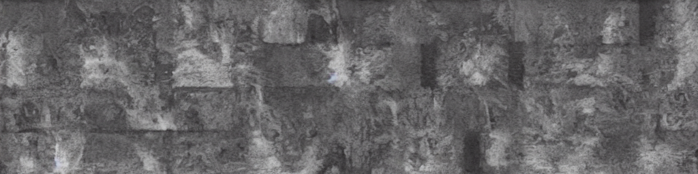
  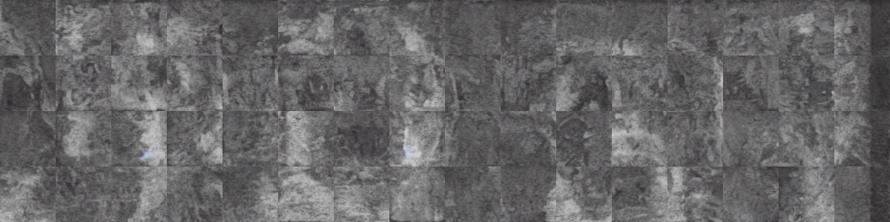

 **image_prompt:**
  - (left) painting of violin, lithograph style, grayscale
  - (right) painting of cows, lithograph style, grayscale

**audio_prompt:** 
  - (left) violin music
  - (right) cow mooing
    

  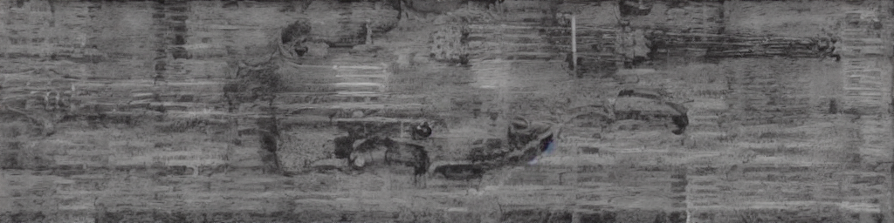
  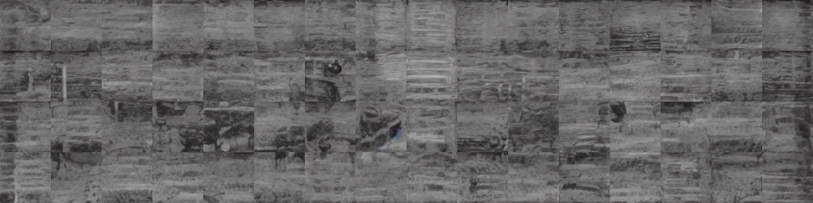

### Anagram type: Patch rotation (90 degrees)

  **image_prompt:**
  - (left) painting of a park, lithograph style, grayscale
  - (right) painting of a plane, lithograph style, grayscale

**audio_prompt:** 
  - (left) bird chirping
  - (right) airline fly by
    

  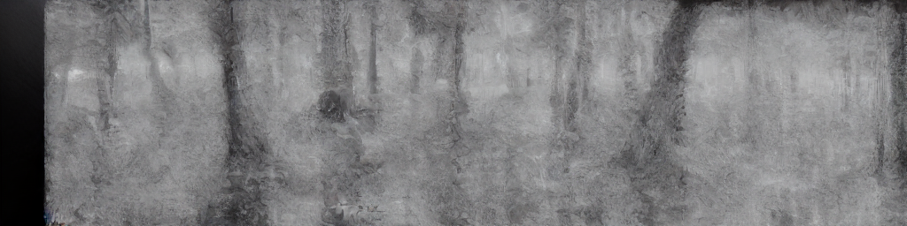
  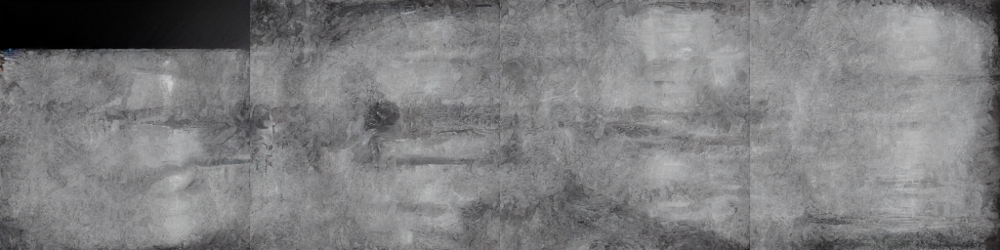

  **image_prompt:**
  - (left) paiting of car, lithograph style, grayscale
  - (right) painting of bell tower, lithograph style, grayscale

**audio_prompt:** 
  - (left) car beeping
  - (right) bell ringing
    

  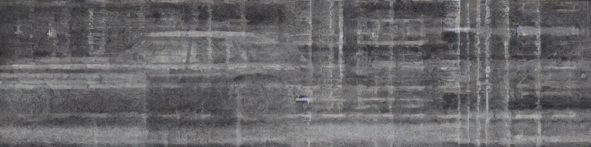
  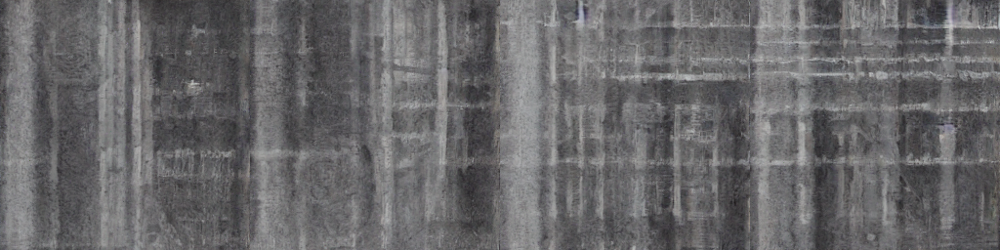

### Colorization

With exactly the same prompts as above:

Patch permutation example:

  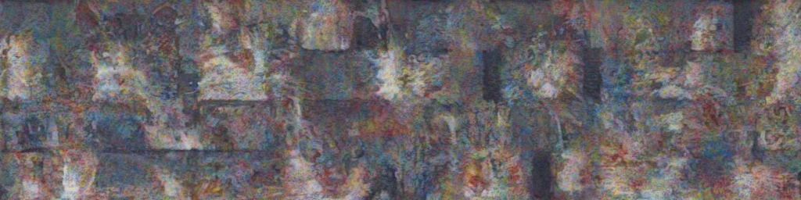
  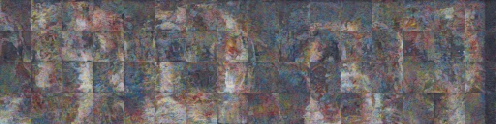

Patch rotation example:

  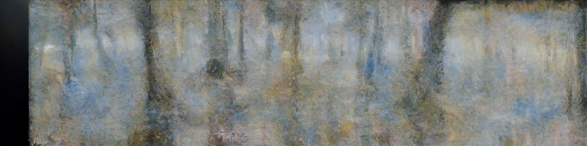
  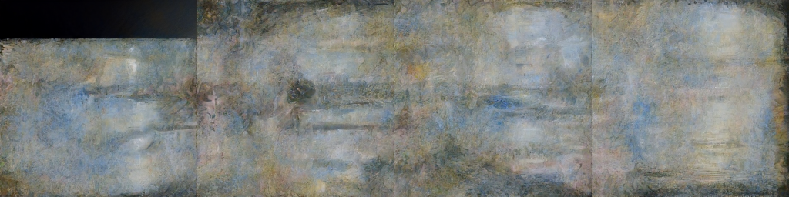

## Main paramters to tune in [config](configs/main_config/main.yaml).trainer

<code> views </code> This is the anagram type you want to create. See **VIEW_MAP** dictionary in [this file](visual_anagrams/views/__init__.py) for type list.

<code> anagram_image_weight & anagram_audio_weight </code> This is to control the visual/audial emphasis on **different views**. Usually a slightly biased weight produces better results.

<code> image_prompt & audio_prompt </code> This is the description of the visual/audial content you want to generate.

<code> audio_weight </code> This is to control the visual/audial balance **in the same view**. To generate hybrid image without engraved spectrogram, set this parameter to 0.

## How to run

You can use the following demo for testing.

